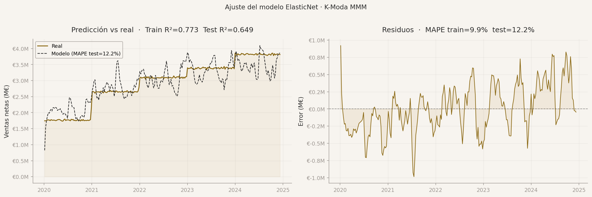
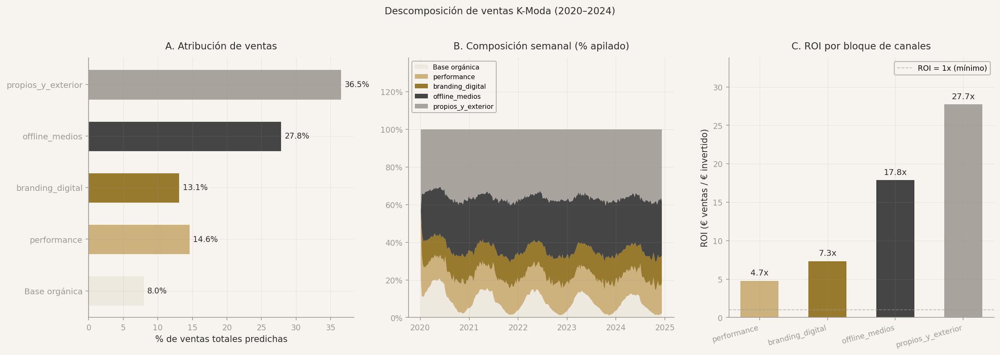

# Marketing Mix Model — K-Moda

[](https://github.com/alejandrobarreche/Marketing-IA/actions/workflows/ci.yml)


A Marketing Mix Model (MMM) for a fashion retailer: five years of weekly national sales explained by media spend in four channel blocks plus seasonality and business controls. Adstock and saturation transforms, a non-negative ElasticNet, a placebo test to make sure the media signal is real, bootstrap confidence intervals, budget scenarios and a Streamlit dashboard to explore them.

> Case study for the *Artificial Intelligence* course, Mathematical Engineering degree, Universidad Alfonso X el Sabio (2025–26). K-Moda is a fictional brand and the dataset is synthetic, provided by the course. See `docs/case_description.pdf` (Spanish).



## Question

Marketing spends across eight channels every week. Which of that spend actually moves sales, how much sales would happen anyway, and where should the next euro go? An MMM answers this with a regression on aggregate time series, no user-level tracking needed.

## Pipeline

| # | Notebook | What it does |
|---|----------|--------------|
| 1 | `1-etl.ipynb` | Seven raw tables (sales lines, orders, customers, products, traffic, calendar, media spend) → one row per ISO week, 2020–2024, 258 weeks |
| 2 | `2-data_understanding.ipynb` | Target distribution, seasonality (month × year), spend by channel, correlation with sales |
| 3 | `3-data_preparation.ipynb` | Eight channels grouped into four blocks, geometric adstock with fixed priors, `log1p(x / k)` saturation, scaling fit on the whole series |
| 4 | `4-modeling.ipynb` | Year-stratified 80/20 split, `ElasticNetCV` with `positive=True`, ablations, block bootstrap (500 draws, 4-week blocks), placebo test, sales decomposition |
| 5 | `5-model_evaluation.ipynb` | Metrics, coefficient intervals, decomposition, three budget scenarios with bootstrap lift, sensitivity tornado |

Outputs of every stage are committed under `data/warehouse/version1/` (CSV, pickled model, scalers, figures) so the dashboard and the tests run without the raw data.

## Results

| | Train | Test |
|---|:-:|:-:|
| R² | 0.773 | 0.649 |
| MAPE | 9.9 % | 12.2 % |

- **Placebo test**: replacing the media variables by autocorrelated noise drops test R² to 0.114. The gap of +0.535 is the media signal the model is actually picking up.
- **Only controls, no media**: test R² 0.023. Media explains most of the variance beyond seasonality and trend.
- **Sales decomposition** over 2020–2024: 8 % organic base, 92 % attributed to media, with return on investment per block between 4.7× (performance) and 27.7× (owned and outdoor).



| Channel block | Share of sales | ROI |
|---|:-:|:-:|
| Owned and outdoor (`propios_y_exterior`) | 36.5 % | 27.7× |
| Offline media | 27.8 % | 17.8× |
| Performance | 14.6 % | 4.7× |
| Branding digital | 13.1 % | 7.3× |

The "do something" scenario in notebook 5 moves 30 % of the performance budget to owned and outdoor and estimates the annual lift with its bootstrap interval. The full analysis, in Spanish, is in `report/main.pdf`.

## Dashboard

```bash
streamlit run app.py
```

Four tabs: overview of spend and sales, channels and attribution, an investment lab that re-runs the adstock and saturation transforms for any weekly spend per block, and the model itself (fit, residuals, coefficients with bootstrap intervals).

## Quickstart

```bash
conda create -n mmm python=3.11 && conda activate mmm
pip install -r requirements.txt
pytest                  # artifact consistency + reported metrics
streamlit run app.py
```

Re-running the notebooks from scratch needs the seven raw CSV files from the course in `data/lake/`, which are not redistributed.

## Project structure

```
1-etl.ipynb … 5-model_evaluation.ipynb   pipeline, run in order
app.py                    Streamlit dashboard
data/warehouse/version1/  etl.csv, data_preparation.csv, elastic_net.pkl, adstock_params.pkl, scalers.pkl, figures
report/                   LaTeX report (main.pdf) and the figures used here
docs/                     case description and final slides
tests/                    pytest on the committed artifacts
.github/workflows/        ruff + pytest on every push
```

## Limitations

- Synthetic data with an unusually strong media signal: 92 % attribution and ROIs above 10× should not be read as typical of real MMMs.
- 258 weekly observations and a random year-stratified split, not a time-based hold-out. The bootstrap intervals in notebook 4 are the honest measure of uncertainty.
- Adstock decay and saturation parameters are fixed priors, not fitted jointly with the regression.
